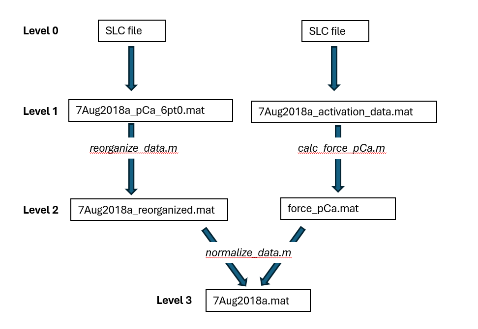

# Data

Several levels of data can be distinguished (see Figure below)
- Level 0: this is the raw data
- Level 1: raw data transported to MAT format
- Level 2: raw data reorganized such that there is 1 file per fiber and 1 file containing force-pCa relations of all fibers (`force_pCa.mat`, provided in this folder). 
- Level 3: normalized data in which forces are normalized with respect to the force-pCa data

At this time, Level 3 data is provided to the manuscript reviewers. 
This data can be used to compute short-range stiffness (summary) data using `calc_data_SRS.m`.
The resulting file is called `SRS_data.mat` and is provided in this folder. 
Both the Level 3 data (containing time-series) and the SRS summary data can be used to reproduce the manuscript figures (see [biophysical-muscle-model/Reproduce](https://github.com/timvanderzee/biophysical-muscle-model/tree/main/Reproduce)).

Note: Level 3 data is sufficient to reproduce the data portion of the manuscript. Optionally, `process_data.m` can be used to compute Level 2 and 3 data from Level 1 data, if the latter is provided. We intend to publish all data levels open-access upon manuscript publication. 
