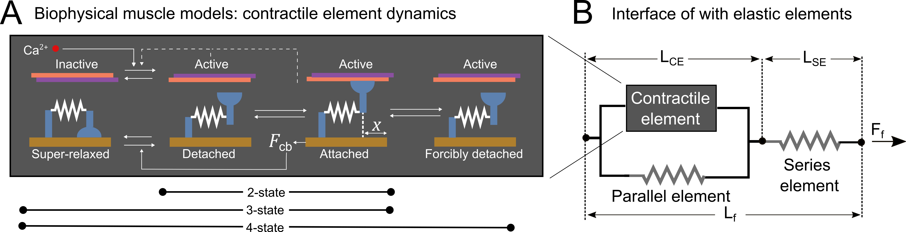

# biophysical-muscle-model repository

Welcome to this repository! 

This repository allows you to use a range of biophysical muscle models and evaluate their force predictions when undergoing imposed length changes. 2-state, 3-state and 4-state biophysical models are included, each interfaced with in-series and in-parallel elastic elements (see figure below). The models and experimental data are described in detail in our [preprint](https://www.biorxiv.org/content/10.1101/2025.10.31.685881v1).

There are various things you could use this code for:
- To reproduce the [preprint's](https://www.biorxiv.org/content/10.1101/2025.10.31.685881v1) results and figures, go to [biophysical-muscle-model/Reproduce](https://github.com/timvanderzee/biophysical-muscle-model/tree/main/Reproduce).
- To test the model for other types of experimental conditions, go to [biophysical-muscle-model/Test](https://github.com/timvanderzee/biophysical-muscle-model/tree/main/Test).
- To re-fit the model parameters, go to [biophysical-muscle-model/Fitting](https://github.com/timvanderzee/biophysical-muscle-model/tree/main/Fitting).

## Before you start: set up your local paths
Please edit `get_paths.m` and specify:
- `githubfolder`: always required, should contain this repository (cloned or downloaded)
- `outputfolder`: only required if you are looking to reproduce model time-series. 
- `datafolder`: only required if you are looking to reproduce data time-series. 

## Contact
If you have any questions regarding this repository, please contact me at tim.vanderzee@kuleuven.be
