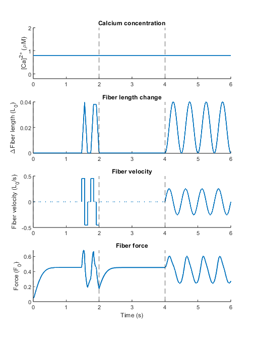

# Test

To test a given model for a given input, run `test_model.m`.
Running `test_model.m` should result in the following figure:

This figure shows the model inputs (i.e. calcium, length, velocity) and the resulting model ouput (i.e. force) for three types of protocols:
- Ramp protocol as in our [preprint](https://www.biorxiv.org/content/10.1101/2025.10.31.685881v1) (t = 0-2 s)
- Isometric protocol (t = 2-4 s)
- Sinusoidal protocol (t = 4-6)

The user can change each protocol, or add their own protocol. 

As explained in `test_model.m`, there are several steps involved:
1) specify inputs
2) specify model function
3) specify model parameters
4) determine initial state
5) simulate model
6) analyze simulation output

Each of these steps is explained in further detail below

## Step 1: specify inputs
The biophysical models have 3 inputs, namely:
- calcium concentration
- fiber length
- fiber velocity

Each of these inputs must be specified as a function of time. The `test_model.m` script requires a struct (array) called 'input' that contains the following fields:
-       t: [1×N double]
-       L: [1×N double]
-       v: [1×N double]
-       Ca: [1×N double]

These fields specify time (s), fiber length (L0), fiber velocity (L0/s) and calcium concentration (uM).
   
## Step 2: specify model function
You can choose between the following models:
- 2-state XB
- 2-state XB coop
- 3-state XB coop
- 4-state XB coop

## Step 3: specify model parameters
You can use the provided parameters in [biophysical-muscle-model/Parameters](https://github.com/timvanderzee/biophysical-muscle-model/tree/main/Parameters).
Given the model file (Step 2), you only need to decide the fiber for which you want to use the parameters. 

Alternatively, you could use your own set of model parameters. 

## Step 4: simulate model
You are now ready to simulate the model. You will do this by calling the `simulate_model` function with the following inputs:
- `model`: containing the model (step 2)
- `modelfunc`: containing the model function (step 2)
- `input`: containing the input (step 1)
- `newparms`: containing the parameters (step 3)

After simulating the model you can visualize the obtained force and add it to the figure (see above).
